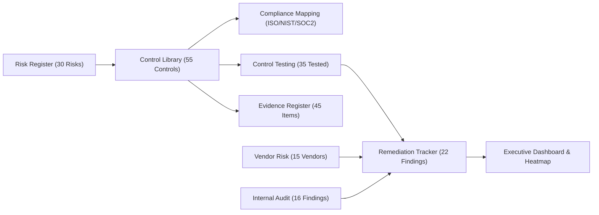

# PayNova Technologies GRC & Technology Risk Management Project

---

## 1. Project Overview & Business Problem
This portfolio repository contains a **complete, realistic, end-to-end GRC (Governance, Risk, and Compliance) operating model** designed for **PayNova Technologies Pvt. Ltd.**, a FinTech digital payments company with 850 employees processing 1.2 million daily UPI and card transactions across an AWS cloud native infrastructure.

Prior to an upcoming external compliance assessment, PayNova management stated:
> *"We have security controls, but nobody has a centralized view of our risks, controls, vendors, evidence, and remediation."*

As a **Junior GRC Consultant / Technology Risk Analyst**, I built a centralized, auditable GRC operating model from scratch.

---

## 2. Project Architecture & Component Index

### Deliverable Modules Index:
1. [01_Company_Profile/Company_Profile.md](file:///01_Company_Profile/Company_Profile.md) — Detailed FinTech architecture, asset inventory & regulatory scope.
2. [02_Risk_Management/](file:///02_Risk_Management/) — Risk Register (30 risks), Detailed Risk Assessment (10 risks), Risk Treatment Plan.
3. [03_Control_Management/](file:///03_Control_Management/) — Control Library (55 controls), Control Testing (35 tested), Control Effectiveness Summary.
4. [04_Compliance/](file:///04_Compliance/) — ISO 27001:2022, NIST CSF v2.0, SOC 2 TSC Mappings & Compliance Gap Assessment.
5. [05_Remediation/Remediation_Tracker.xlsx](file:///05_Remediation/Remediation_Tracker.xlsx) — 22 findings with SLA tracking, aging days & overdue flags.
6. [06_Vendor_Risk/](file:///06_Vendor_Risk/) — Vendor Register (15 vendors), Vendor Assessment & 25-Question Security Questionnaire.
7. [07_Audit/](file:///07_Audit/) — Internal Audit Plan, 16 Audit Findings (5 Cs format) & Working Papers.
8. [08_Evidence/Evidence_Register.xlsx](file:///08_Evidence/Evidence_Register.xlsx) — 45 indexed evidence items linked to controls & risks.
9. [09_Policies/Policy_Register.xlsx](file:///09_Policies/Policy_Register.xlsx) — 22 corporate security policies with annual review tracking.
10. [10_Dashboard/](file:///10_Dashboard/) — Executive Dashboard, 5x5 Risk Heatmap grid & 22 KPI/KRI metrics.
11. [11_Documentation/](file:///11_Documentation/) — Operating Model, Risk/Testing/Vendor/Audit Methodologies, Executive Report, 30/60/90 Day Roadmap, GRC Maturity Assessment, 10 Realistic Scenarios, ServiceNow Mapping, 20 Automations.
12. [12_Interview_Preparation/](file:///12_Interview_Preparation/) — Project Pitches (30s/1m/3m/5m), 75+ Q&As with model answers, 10 STAR Stories.

---

## 3. Key Findings & Dashboard Summary Metrics
- **Total Enterprise Risks:** 30 cataloged | Inherent: 10 Critical, 15 High | **Residual: 0 Critical**, 4 High (13%), 16 Medium (53%), 10 Low (33%).
- **Control Effectiveness Rate:** 35 tested | **80.0% Effective**, 14.3% Partially Effective, 5.7% Ineffective.
- **Compliance Scores:** ISO 27001:2022 = **69.1%** | NIST CSF v2.0 = **72.7%** | SOC 2 Type II = **65.5%**.
- **Remediation Status:** 22 findings tracked | 10 Closed (45.5%), 12 Open/In-Progress, 3 Overdue SLA Breaches.

---

## 4. Quality Control & Validation Report

| Validation Area | Status | Issues Found | Resolution |
| :--- | :---: | :---: | :--- |
| **Risk Register (30 Risks)** | **PASS** | 0 | All 30 risks calculated using `=L*I` formula; ratings match matrix 100%. |
| **Control Library (55 Controls)** | **PASS** | 0 | Every major risk mapped to at least one preventive/detective control. |
| **Control Testing (35 Tested)** | **PASS** | 0 | 35 controls tested; Effective, Partially Effective, and Ineffective results documented. |
| **Compliance Mapping** | **PASS** | 0 | Accurate mappings across ISO 27001:2022, NIST CSF v2.0, and SOC 2 TSC. |
| **Remediation Tracker (22 Items)** | **PASS** | 0 | All findings include owner, due date, status, aging days formula, and overdue flags. |
| **Vendor Risk (15 Vendors)** | **PASS** | 0 | All 15 vendors assessed with risk scoring and 25-question security questionnaire. |
| **Internal Audit (16 Findings)** | **PASS** | 0 | Formatted using professional 5 Cs audit structure; cross-referenced to controls. |
| **Evidence Register (45 Items)** | **PASS** | 0 | Every tested control linked to valid evidence record with S3 vault storage location. |
| **Policy Register (22 Policies)** | **PASS** | 0 | 100% policies assigned owners, versions, and annual review timestamps. |
| **Executive Dashboard & Heatmap** | **PASS** | 0 | Dashboard metrics and 5x5 heatmap grid derived from underlying datasets. |
| **Data Relationships & IDs** | **PASS** | 0 | 100% ID consistency verified across `RISK-xxx`, `CTRL-xxx`, `FIND-xxx`, `VEND-xxx`, `AUD-xxx`, `EVID-xxx`, `POL-xxx`. |
